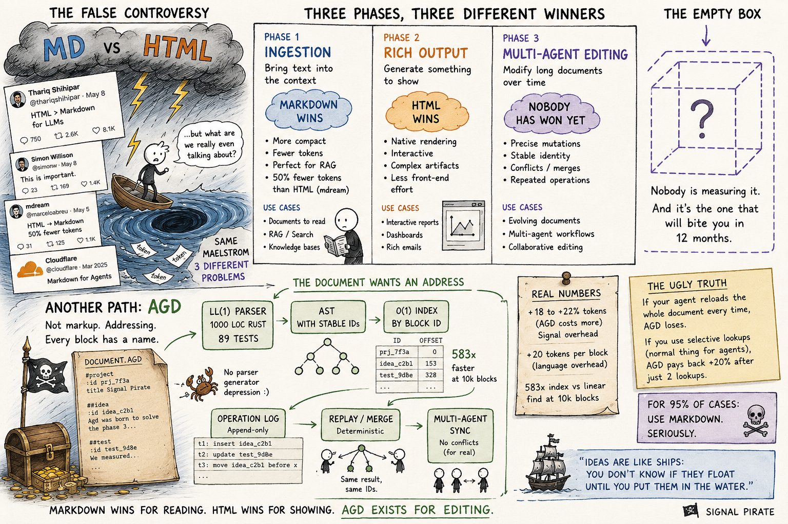

# AGD — Agent Document Format

<p align="center">
  <a href="image.png">
    
  </a>
  <br />

A line-oriented text format optimised for LLM agents. Sits between
Markdown (too ambiguous for safe machine editing) and HTML/XML (too
verbose for token-constrained contexts). Every block is independently
addressable via a stable `[#id]`, so multiple agents can edit the same
document without fighting over byte ranges.

```agd
@meta title="Welcome" author=alice

@h1 Hello [#intro]
@p AGD blocks start with `@<tag>` at column 0 — that is the entire syntactic story.

@h2 Features [#features]
@ul
- token-efficient vs HTML and JSON
- deterministic LL(1) parsing
- stable per-block IDs for multi-agent editing
- canonical form: byte-stable round-trip

@code lang=python [#hello]
~~~
def hello():
    return "world"
~~~

@ref #hello
```

## Why a new format?

Markdown is great for humans. But ambiguity (CommonMark vs GFM vs MDX),
implicit semantics (paragraph boundaries, nested-list rules), and lack
of stable per-block addresses make it painful for LLM agents that need
to edit, re-edit, and merge changes deterministically. HTML and XML
solve those problems but cost ~18% more tokens and need a real DOM.
JSON is unambiguous but illegible in `cat`.

AGD trades a small token premium against Markdown for:

- **Deterministic LL(1) parsing** — no backtracking, single-pass, ~1000 lines of Rust
- **Stable per-block IDs** — every editable unit has a name, not a byte offset
- **Pure-data edit operations** — JSON-serialisable, replayable, conflict-detectable
- **Byte-stable canonical form** — verified by 256+ proptest cases
- **No-panic recovery** — every malformed input yields a typed error

## Install

```sh
cargo install --path .
```

The binary is called `agd`.

## CLI

```sh
agd validate          file.agd                 # exit 0 if valid
agd parse --json      file.agd                 # AST as JSON
agd format --check    file.agd                 # canonical-form check
agd format -i         file.agd                 # rewrite in place

agd convert from-md   README.md                # MD → AGD
agd convert to-md     spec/AGD-SPEC.agd        # AGD → MD
agd convert to-html   examples/tutorial.agd    # AGD → minimal HTML

agd bench             file.agd                 # token count vs MD/HTML/JSON
agd id   --add        file.agd                 # auto-assign IDs
agd ref  --check      file.agd                 # verify @ref targets

agd ids    file.agd                            # list addressable block ids (TOC)
agd ids    file.agd --kind x-feedback          # filter TOC by block kind
agd search file.agd "redis" -i                 # grep on block bodies, returns matching ids
agd get    file.agd '#a' '#b' '#c'             # fetch one or many blocks (single parse)

agd backlinks file.agd '#id'                   # who points to #id (inline @ref + refs= attr)
agd get  file.agd '#id' --with-backlinks       # fetch #id and every block that cites it
agd get  file.agd '#id' --follow-refs --depth 3 # walk refs= outbound transitively

agd edit file.agd --op '{
  "op":    "set_attr",
  "id":    "intro",
  "key":   "lang",
  "value": "english"
}'
```

## Daemon mode (`agdd`)

For multi-agent editing where many ops land per second, the CLI
(fork+exec per op) is the wrong tool. The repo ships `agdd`, a long-lived
daemon that drains a Redis Stream of logical edit operations and applies
them in-memory:

```sh
agdd \
  --redis-url redis://127.0.0.1:6379/ \
  --stream    agd:doc:incident-001:ops \
  --state-key agd:doc:incident-001:state \
  --group     agdd-group \
  --consumer  agdd-1
```

Logical ops have the shape:

```json
{"kind":"append_item","target":"findings","payload":{"text":"..."},"agent":"analyst"}
{"kind":"rename_section","target":"findings","payload":{"new_name":"..."},"agent":"analyst"}
{"kind":"set_attr","target":"meta","payload":{"key":"severity","value":"high"},"agent":"auditor"}
```

Per-op latency is ~2.3 µs end-to-end (parse-once + DocumentIndex + Redis
network roundtrip). Source: [`src/bin/agdd.rs`](src/bin/agdd.rs).

## Library API

The straightforward pattern — fine for small documents:

```rust
use agd::{parse, serialize, edit::Operation};

let mut doc = parse("@h1 Hello [#intro]\n@p Body\n")?;
doc.apply(Operation::SetAttr {
    id:    "intro".into(),
    key:   "lang".into(),
    value: "english".into(),
})?;
println!("{}", serialize(&doc));
```

Since v0.1.1, `Document::apply` and `Document::find` use an internal
HashMap cache automatically — no need to build a separate
`DocumentIndex` for the common case. Lookups are O(1) amortised; the
cache is invalidated by structural ops (insert / delete / replace
where id changes) and stays valid otherwise.

Measured impact at 10k blocks: edit op latency dropped from ~26 µs to
~4 µs per op (6.3× speedup) when integrated into the public API.

For read-only workflows where you want explicit control over the
index lifetime, the `DocumentIndex` companion type is still public:

```rust
use agd::{parse, index::DocumentIndex};

let doc = parse(&large_source)?;
let idx = DocumentIndex::build(&doc);   // O(n) once, then O(1) lookups
let pos = idx.position("auth-flow");
```

See [`src/edit.rs`](src/edit.rs) for the full operation algebra and
[`src/index.rs`](src/index.rs) for the standalone index.

## Performance

Reproducible benchmark report at [`benches/BENCHMARKS.md`](benches/BENCHMARKS.md).
Run with `cargo run --release --bin agd-bench`. Inputs are deterministic
synthetic corpora generated by `agd::corpus`; same seed and size on any
machine produces identical bytes.

Headlines on a single core, release profile:

| Axis                       | Result                         |
|----------------------------|--------------------------------|
| Parse throughput           | **~60 MB/s** sustained at 100k blocks |
| Serialize throughput       | **~830 MB/s** — 10× faster than parse |
| Edit op via library (1k blocks)        | **~2 µs** = ~500k edits/sec   |
| Edit op via `agdd` (Redis Streams, end-to-end) | **~2.3 µs** = ~430k edits/sec |
| Find by ID, 10k blocks: linear vs indexed | **21 µs vs 36 ns = 583× speedup** |
| Find by ID, 100k blocks: linear vs indexed | **283 µs vs 108 ns = 2625× speedup** |
| AST overhead                | ~4× source byte size           |
| Edit via CLI subprocess     | ~13 ms (parse + apply + serialize per call) |

The `agdd` row above is the realistic end-to-end latency for a multi-agent
editing workflow: a Rust daemon reads logical ops from a Redis Stream
(`XREADGROUP`), applies them in-memory via the library API + `DocumentIndex`,
serializes back to a Redis Hash, ACKs. Includes the Redis network roundtrip.
Measured in the companion lab at
[`pinperepette/blog`](https://github.com/Pinperepette/blog/tree/main/scripts/ogni-blocco-ha-un-nome/v2_redis).

**vs. CommonMark via `pulldown-cmark`** (one of the most optimised MD
parsers in existence): AGD is **2–3× slower at parse** on large
documents. On documents under 1k blocks AGD is faster because there is
no setup overhead. The honest takeaway: AGD does not claim to beat
pulldown-cmark on raw parse speed.

## Determinism and recovery

These are the properties that make HTML attractive — and that Markdown
loses on edge cases. AGD enforces them by construction and verifies
them in tests.

| Guarantee | Where it's checked |
|---|---|
| Same input always produces the same AST (50 iterations × 500 blocks) | `tests/determinism.rs` |
| Canonical form is a fixed point under repeated application | `tests/determinism.rs` |
| Whitespace runs do not affect AST equality | `tests/determinism.rs` |
| Duplicate IDs raise a typed error | `tests/determinism.rs` |
| Tags without `x-` prefix that aren't built-ins are rejected | `tests/determinism.rs` |
| Truncating at any byte never panics — yields error or partial parse | `tests/recovery.rs` |
| Random byte fuzz over 200 inputs never panics | `tests/recovery.rs` |
| Unterminated fences and quoted attrs yield typed diagnostics | `tests/recovery.rs` |
| Roundtrip stability over random documents (256 cases × 2 properties) | `tests/roundtrip.rs` |

## Token economy

Two numbers matter, not one. Measured with `cl100k_base` —
see [`benches/BENCHMARKS.md`](benches/BENCHMARKS.md) section 7
and [`benches/RETRIEVAL.md`](benches/RETRIEVAL.md) for the full data.

### Whole-document loading

The cost of giving the entire document to the model in a single request:

| Format       | vs AGD                       |
|--------------|------------------------------|
| HTML         | **+16% to +19%** more tokens |
| JSON         | **+135% to +145%** more tokens |
| Markdown     | **−18% to −22%** — Markdown wins by ~20% |

Markdown is consistently smaller. That is the honest tradeoff for
deterministic parsing, canonical round-trip, and stable block IDs.

### Selective retrieval (where AGD flips the result)

The realistic agent shape: "find the block called `#auth-flow` and
answer about it". With AGD, an agent loads the Table of Contents (just
the ids), picks the target id, requests only that block. With Markdown
there is no stable id mechanism, so the agent must load the whole
document and pattern-match the heading.

| blocks | AGD selective (TOC + block) | Markdown whole-doc | speedup |
|---:|---:|---:|---:|
| 100 | 231 tokens | 2,074 tokens | **9.0×** |
| 1,000 | 1,720 tokens | 20,502 tokens | **11.9×** |
| 10,000 | 14,902 tokens | 217,170 tokens | **14.6×** |

Numbers measured by `cargo run --release --bench retrieval`. Savings
grow with document size — at 100k blocks the selective request is
roughly 1/20 of Markdown's whole-doc cost.

### When the +20% is worth it

If your agent always loads whole documents, AGD costs more for nothing.
Use Markdown.

If your agent does targeted block-level retrieval, you pay the +20%
once on whole-doc loads (rare) and save **9×–14×** on every selective
request (common). The crossover is around the second selective lookup
per document.

If your agent edits the document over time and you care about
deterministic ops, audit trail, and replay — that is the multi-agent
edit story, where AGD is designed to be the answer regardless of token
counts.

## Edit safely from many agents

The model: agents emit operations, not text diffs. Operations target
blocks by their stable `[#id]`. Two agents working on different IDs
never conflict. Two on the same ID generate a *detectable* conflict
that the host resolves (last-write-wins by default).

```json
{"op": "replace",       "id": "intro", "with": {…block…}}
{"op": "insert_after",  "id": "intro", "block": {…}}
{"op": "insert_before", "id": "intro", "block": {…}}
{"op": "delete",        "id": "intro"}
{"op": "set_attr",      "id": "intro", "key": "lang", "value": "rust"}
{"op": "remove_attr",   "id": "intro", "key": "lang"}
```

For mixed-trust scenarios, an optional 8-character SHA-1 prefix on the
ID (`[#name:abcd1234]`) lets an agent verify the block has not been
mutated since the operation was authored. Hash format is parsed in
v0.1; enforcement lands in v0.2.

## Specification

Source: [`spec/AGD-SPEC.agd`](spec/AGD-SPEC.agd) — written in AGD itself
(dogfood). Rendered: [`spec/AGD-SPEC.md`](spec/AGD-SPEC.md), regenerated
by `agd convert to-md`. Grammar: [`grammar/agd.ebnf`](grammar/agd.ebnf)
(frozen for v0.1).

## Project layout

```
agd/
├── Cargo.toml
├── grammar/agd.ebnf             frozen v0.1 grammar
├── spec/                        spec source (.agd) + rendered (.md)
├── examples/                    four real-world documents + stress.agd
├── benches/
│   ├── BENCHMARKS.md            full perf report (reproducible)
│   ├── RESULTS.md               per-example token table
│   ├── parse.rs                 criterion microbenches
│   └── tokens.rs                token-count emitter
├── src/
│   ├── lib.rs                   public API
│   ├── lexer.rs                 line classifier (~150 lines)
│   ├── parser.rs                block assembler + inline parser
│   ├── ast.rs                   type system
│   ├── serializer.rs            canonical form
│   ├── edit.rs                  operation algebra
│   ├── id.rs                    ID slugging + content hashing
│   ├── index.rs                 DocumentIndex — O(1) random access
│   ├── corpus.rs                deterministic synthetic-corpus generator
│   ├── convert/                 MD ↔ AGD ↔ HTML
│   └── bin/
│       ├── agd.rs               user-facing CLI
│       ├── agdd.rs              Redis Streams daemon (multi-agent edit)
│       └── agd-bench.rs         benchmark runner → BENCHMARKS.md
└── tests/
    ├── conformance/             paired .agd / .json fixtures
    ├── conformance.rs           corpus runner
    ├── roundtrip.rs             proptest: serialize → parse → equal
    ├── determinism.rs           same input → same AST, repeatedly
    ├── recovery.rs              partial-input + malformed-input behaviour
    └── cli.rs                   binary integration tests
```

## Status

v0.3 — grammar frozen, full toolchain, **98 tests** across 10 suites
(unit / property / conformance / determinism / recovery / CLI / corpus /
index / doc-tests), plus a reproducible benchmark report at four scales.

Format and parser API are stable from this point. Breaking changes
require a major version bump.

Recent CLI additions:
- v0.1.1 — `Document::apply` indexed-by-default; `agd ids` surfaces `desc=`; `agd search`; batch `agd get`
- v0.2.0 — `agd backlinks` + `refs="#a,#b"` attribute convention as a graph channel
- v0.3.0 — `agd get --with-backlinks` and `--follow-refs --depth N` for one-shot traversal

## Roadmap

- v0.4 — fix the parser's inline `@ref` (grammar already allows it);
  `agd traverse` as a top-level graph-walker; content-hash enforcement
- v0.5 — VS Code extension; tree-sitter grammar; LSP server
- v1.0 — frozen grammar; IANA MIME registration; multi-language parser ports

## License

MIT.
